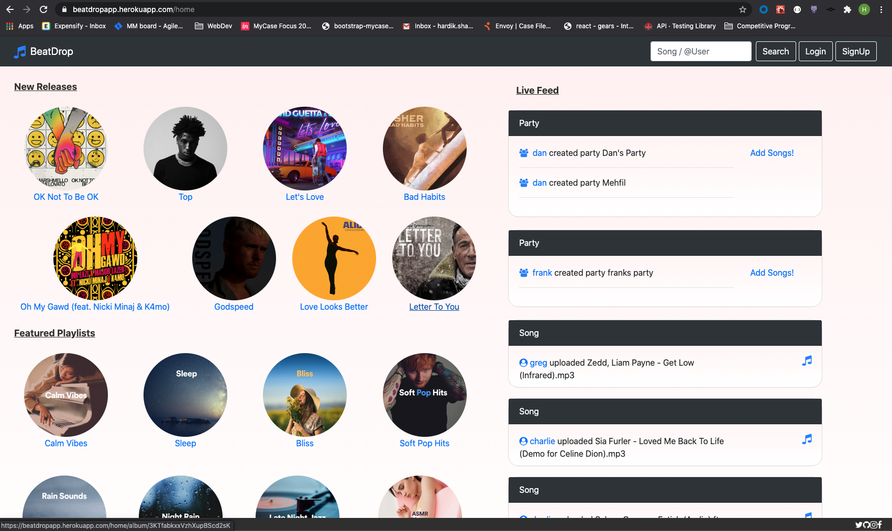

# BeatDrop Client 

Client deployLink: 
https://beatdropapp.herokuapp.com/

Server deploy Link: 
https://beatdrop.herokuapp.com/

The server repository can be found at: 
https://github.com/shardik95/Server-BeatDrop

First open the Server Deploy link (this might take some time)
Then open the Client Deploy link. 

The project is created with reactJs.

The screenshots for the app can be found in screenshot folder in this repository.

#BeatDrop - Music For All : 

A web application where users can share their playlists with the host of the party and the host can thereby merge all the playlists shared by the users following them, and hence create a single playlist based on the song's popularity, that integrates everyone's music taste.

Role1: alice (anonymous user)
Alice is an anonymous user, who is not registered or logged into BeatDrop.
Alice can look for songs, albums and artists using the search bar at the top of the page.
The search function renders all the tracks, artists and albums based on the search query.
On clicking on a particular search result, the details about the song/album/artist will be rendered respectively.
If Alice clicks on a song/artist/album, details are rendered along with the option to like and review and add the song to playlist, but since Alice is anonymous, she will be prompted to login first.
Alice can use the same search bar to look for users’ public profile, by prepending ‘@’ before the name of the user
In the public profile of the already registered users, Alice can view their basic details like their name and email, their followers, users they are following, their feed that shows what songs/artists/albums they have liked and reviewed, and their public playlists. 

Role2: bob/bob (normal user)
Bob is a normal user, with regular user rights.
Bob can look for songs, albums and artists using the search bar at the top of the page.
The search function renders all the tracks, artists and albums based on the search query and can use the same search bar to look for users’/artists’/hosts’ public profile, by prepending ‘@’ before their name
On clicking on a particular search result, the details about the song/album/artist will be rendered respectively along with the option to like and review the song/album/artist. 
If bob is logged in, he can add the songs to his playlist(s).
If bob searched for a user/artist/host, he will be navigated to their public profile page, that renders basic details about them, an option to follow them, their public playlists and their feed. Additionally, Bob can view the songs artists have recently uploaded on BeatDrop. Bob can also add his playlists in the party created by the host and buy tickets for the event generated by the host.
Bob can make changes to his own profile information in the account tab that is only visible to him in his private account and view the activity of the users/artists/hosts he is following in his feed. Bob can create and remove playlists. 

Role3: charlie/charlie (artist)
Charlie is a user registered as an artist on BeatDrop.
Charlie can perform similar to a regular user along with some additional functionalities wherein he can make changes to his own profile information in the account tab that is only visible to him in his private account. charlie can create either a public playlist (visible to followers) or a private playlist (visible only to charlie). Charlie can upload songs to his profile and remove existing songs from his profile.

Role4: dan/dan (host)
dan is a user registered as a host on BeatDrop.
dan can perform similar to a regular user along with some additional functionalities wherein he can merge multiple playlists (added by himself or by other users) together in order to create a single playlist that integrates everybody’s music taste. This playlist gets generated based on the song’s popularity with the most popular song being listed at the top.
dan can make changes to his own profile information in the account tab that is only visible to him in his private account dan can create new parties and events, and remove existing parties and events from his profile.

Role5: admin/admin (User-Admin)
The admin can perform basic CRUD operations on the profiles of the users. The admin can read/create/remove/update the user profiles of the user, artists and hosts. In addition to that, the admin can remove songs uploaded by the artist and their playlists as well parties and events created by the host. One of the special functionalities of the admin is that they can verify any user as an artist, which then enables a regular user to then upload and remove songs in their profile as an artist.

